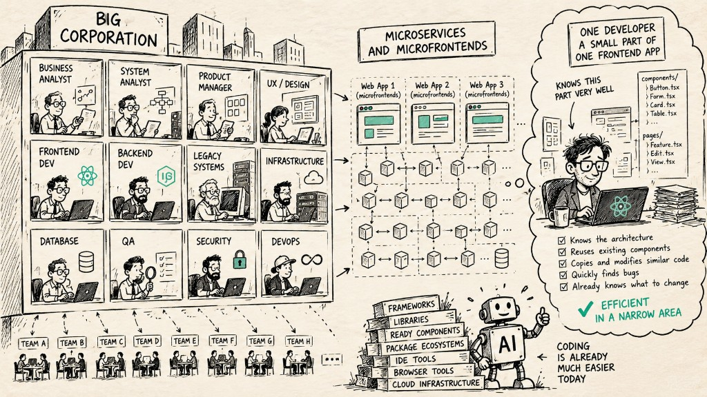
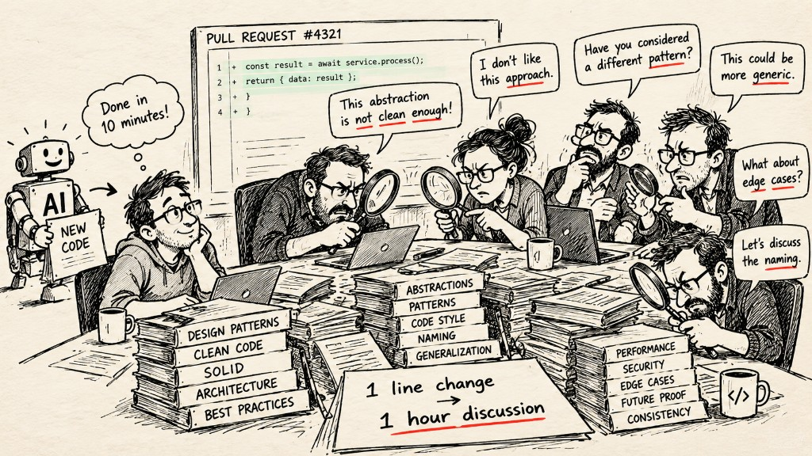
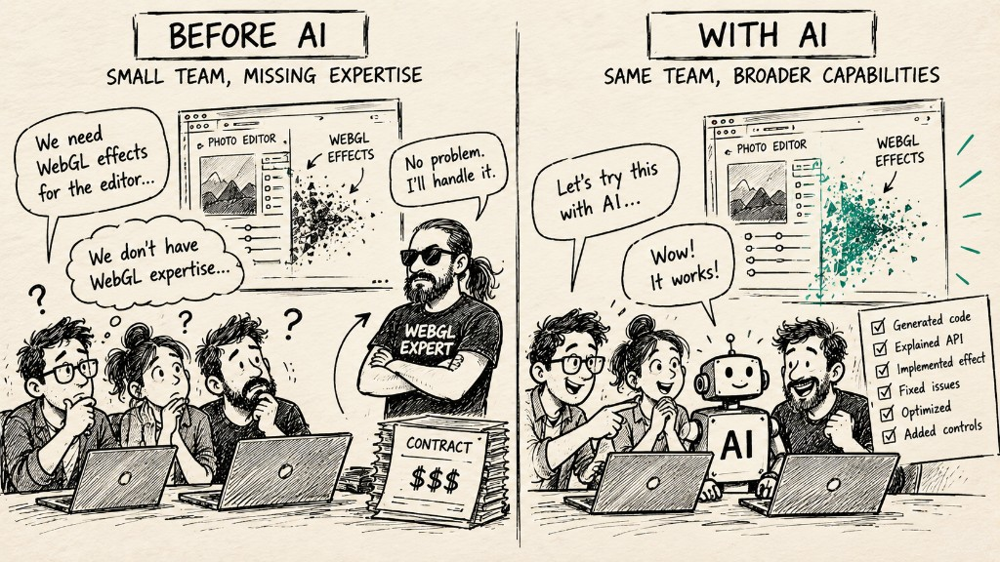
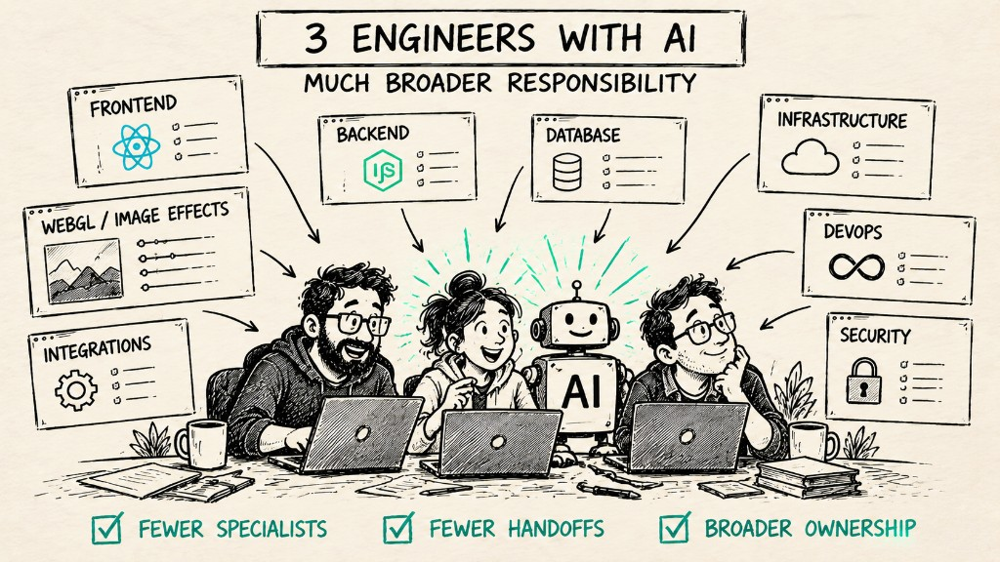
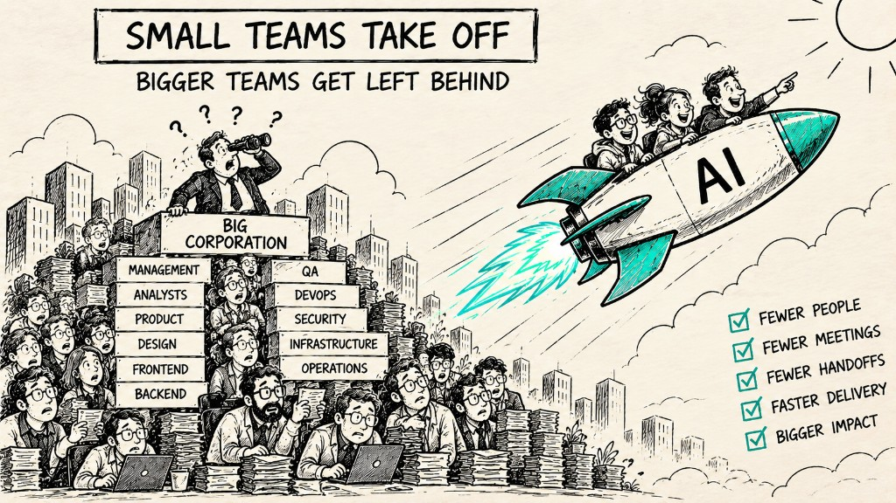

This article is inspired by my experience working for a large insurance corporation.

In 2025–2026, the company was actively introducing AI into its development processes. Like many large organizations, management expected a significant increase in engineering productivity.

AI coding assistants were introduced. Internal AI tools appeared. Developers were encouraged to use them.

And yet, the dramatic productivity increase everyone expected never really happened.

I don't think the main reason was AI itself.

## Let's ignore the technical problems

There were plenty of technical difficulties.

Security, compliance, access permissions, infrastructure, scalability, restrictions on which models could be used, integration with internal systems — the usual problems you would expect when introducing a new technology into a large corporation.

But I don't want to discuss them here.

Let's make an unrealistic assumption and imagine that all of these problems have been solved.

Every developer has access to an excellent AI model. It understands the codebase. It can generate high-quality code. Security and compliance are taken care of. Infrastructure works perfectly.

I still don't think this would produce the productivity revolution many corporations expect.

Because coding is not where most of the time is being lost.

## The corporate developer is already highly optimized

Large companies tend to divide engineering work into increasingly specialized roles.

In our case, there were business analysts, system analysts, frontend developers, backend developers, specialists responsible for legacy systems, and people responsible for specific infrastructure components.

Then microservices and microfrontends divided the system even further.

Eventually, you might have a developer responsible for one relatively small part of one frontend application.

And that developer can be extremely efficient inside that narrow area.

They know the architecture. They know the existing components. They know where similar functionality has already been implemented. They know which parts can be reused and which parts can be copied and slightly modified.

They also carry an enormous amount of local context in their head.

A bug appears — they often know where to look.

The business asks for a small change — they already know which components are affected.

A new screen looks similar to an existing one — much of the implementation already exists.

AI can certainly help this developer.

But it is solving a problem that, in many cases, wasn't particularly expensive in the first place.

And this points to something that I think the software industry sometimes forgets:

**Coding stopped being the main bottleneck in software development long before generative AI arrived.**

Modern frameworks, libraries, package ecosystems, reusable components, IDEs, browser developer tools, cloud infrastructure and decades of accumulated abstractions had already made writing code dramatically easier.

AI is another enormous step in that direction.

But corporations have a different bottleneck.

## The real bottleneck is between people

The expensive part of corporate software development often happens at the boundaries: between business and system analysts, frontend and backend developers, engineering and design, product and development, or simply between two teams responsible for different microservices.

This is where context gets lost, priorities diverge, people wait for each other, and meetings begin to multiply. A surprisingly large percentage of engineering time disappears somewhere between these organizational boundaries.

Imagine a completely ordinary feature. The business analyst misunderstood part of the requirement. The system analyst designed it without considering an infrastructure limitation. The backend developer didn't know that the feature had become a priority and continued working on something else. Meanwhile, the frontend developer opened an outdated design because the latest version hadn't been shared with them.

Eventually, product discovers that things aren't moving as expected — perhaps a little late, because the product manager has spent half the sprint jumping between meetings.

Now everyone needs to synchronize.

Messages are written, meetings are scheduled, tickets are updated, requirements are clarified, priorities are discussed, and parts of the architecture are reconsidered. The implementation finally arrives at code review, where another discussion begins about whether a particular abstraction is clean enough. Then another dependency appears, another team needs to approve something, and someone discovers that a requirement has changed.

Meanwhile, the developer is attending refinement, planning, retrospectives, stand-ups and various other mandatory corporate activities.

Now give that developer an AI assistant capable of writing the implementation twice as fast.

What exactly have we fixed?

**Very little.**

If writing code represents only a fraction of the journey from a business idea to production, dramatically accelerating that fraction doesn't dramatically accelerate the whole system. The developer may finish their part sooner, but the feature can still spend days waiting for clarification, review, another team, an approval, or the next meeting.

**AI makes the fastest part of the system faster while leaving the slowest part largely untouched.**

The real bottleneck isn't code. It's the fragmentation of responsibility.

The more narrowly work is divided between people and teams, the more boundaries we create between them. And every boundary creates another handoff: context has to be transferred, decisions synchronized, priorities aligned, and changes communicated.

In other words, **specialization doesn't just divide the work. It multiplies the interactions required to complete it.**

And that is the black hole of large organizations:

**coordination.**

## Code review can become another bottleneck

Code review is a good example of how old processes can absorb much of the productivity gained from AI.

In many teams, review still means that another developer is expected to carefully read and understand the implementation before approving it. This made sense as a way to build confidence in human-written code, but it becomes increasingly expensive when AI can generate implementation much faster than humans can review it.

If AI produces a change in ten minutes and another engineer spends an hour reverse-engineering that change line by line, we haven't eliminated the bottleneck.

**We've simply moved it from writing code to reviewing code.**

I think this happens partly because many teams still treat understanding the implementation as the primary source of trust. With AI-generated code, I believe we need a different model: clear architectural boundaries and contracts, combined with independent validation of behavior, performance, security, and other properties that actually matter.

This doesn't mean eliminating human review or blindly trusting AI. Critical code deserves scrutiny proportional to its risk. But requiring another engineer to deeply understand every generated implementation can erase much of the productivity advantage AI was supposed to create in the first place.

I wrote more about this approach in [The New AI Black Box: Why Your Team Is Still Too Slow](https://kirushakov.com/blog/the-new-ai-black-box).

## AI is still surprisingly powerless here

And this is where today's AI is still surprisingly powerless.

AI can write code. It can explain an unfamiliar API, generate tests, debug an implementation, suggest an architecture, or help a developer work with a technology they barely know.

But it cannot easily fix a broken organizational interface.

It cannot make two teams share the same priorities.

It cannot make the right information reach the right person at the right moment.

It cannot remove a meeting that exists because five people each own a different piece of the same problem.

And it cannot eliminate the coordination overhead created by the organizational structure itself.

This is why I think the biggest productivity gains from AI may happen somewhere else entirely.

## Small teams have the opposite problem

I remember working in small startups where teams of three to five developers had a very different problem.

There simply weren't enough people — or enough expertise.

When we encountered something outside the team's competence, we sometimes had to bring in another specialist.

For example, years ago I worked on an online photo editor. At one point we needed sophisticated visual effects implemented with WebGL.

Nobody on the core team had enough WebGL expertise, so we hired a developer specifically for that work.

Today, I suspect we wouldn't.

A good engineer with modern AI tools could probably cross that competency boundary without adding another person to the team.

And I think this is where things become much more interesting.

## AI can expand the responsibility of one person

Historically, specialization has been one of the natural consequences of increasing software complexity.

As systems became larger, we divided responsibility.

Frontend developers.

Backend developers.

DevOps engineers.

QA engineers.

Database specialists.

Cloud specialists.

Security specialists.

Business analysts.

System analysts.

And specialization works.

But it comes with a price.

Every time responsibility crosses from one person to another, we create a communication boundary.

More people don't just mean more capacity.

They also mean more coordination.

AI changes this equation because it allows an individual engineer to operate effectively across a much wider area of expertise.

A frontend engineer can suddenly do much more backend work.

A backend engineer can work with infrastructure they previously would have handed to a DevOps specialist.

A generalist can implement something involving WebGL without becoming a WebGL expert first.

The important part isn't that AI writes the WebGL code faster.

**The important part is that another person may no longer need to enter the project at all.**

And removing one person can sometimes save more time than making five people faster.

## This is why I expect AI to disproportionately benefit small teams

My prediction is that AI will dramatically strengthen small, cross-functional engineering teams.

Not primarily because AI makes every developer type code faster.

But because it allows fewer people to own much larger parts of a product.

A team that previously needed eight specialists might eventually need four strong generalists with AI.

A project that required frontend, backend, DevOps and several specialized roles might increasingly be handled by two or three engineers who can move across those boundaries with AI assistance.

That changes much more than the cost of writing code.

It reduces handoffs.

It reduces meetings.

It reduces waiting.

It reduces the amount of context that has to be transferred between people.

And, perhaps most importantly, it consolidates responsibility.

Instead of ten people each understanding 10% of the problem, you can have a few people who understand large parts of the system end to end.

That is where I expect the real productivity multiplier from AI to come from.

**The AI revolution in software development may not be about making large teams dramatically faster.**

**It may be about making large teams unnecessary for a much larger class of problems.**
