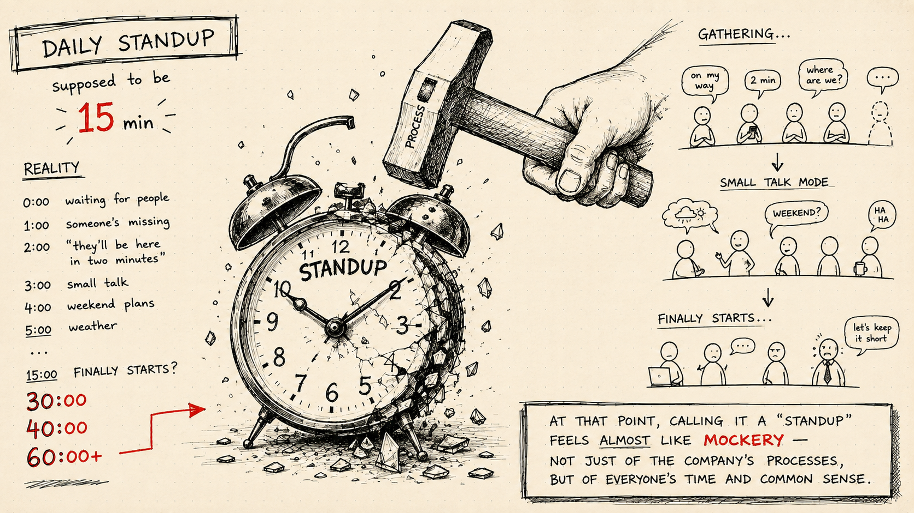
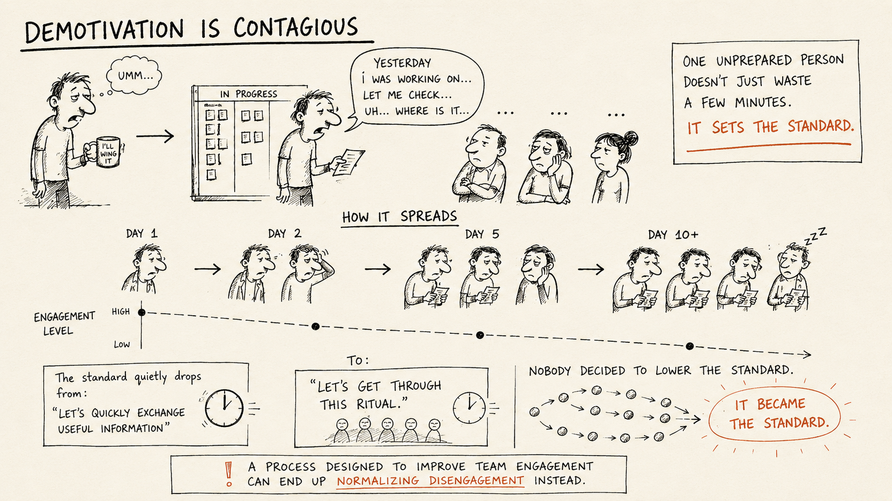
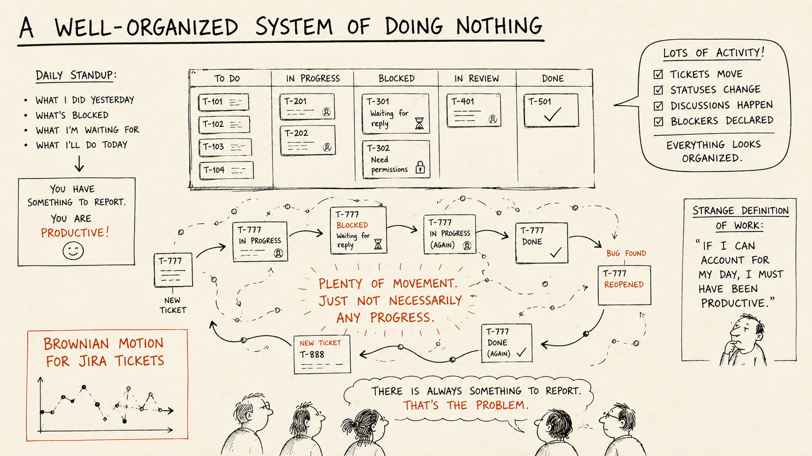
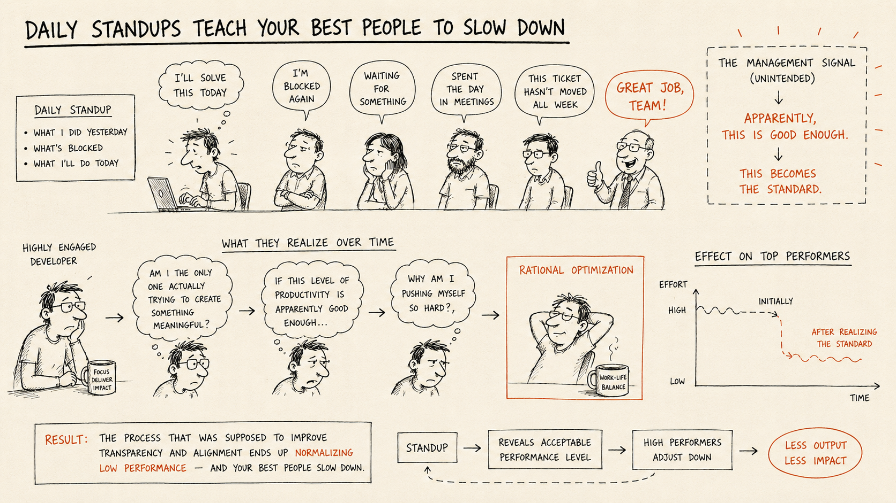
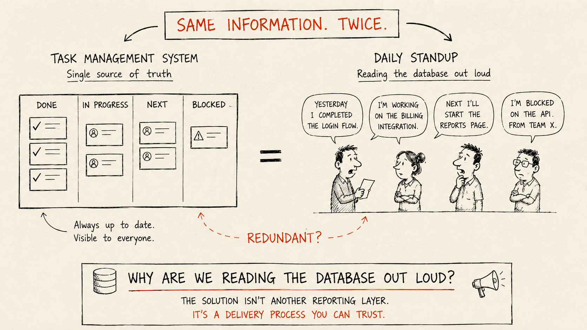
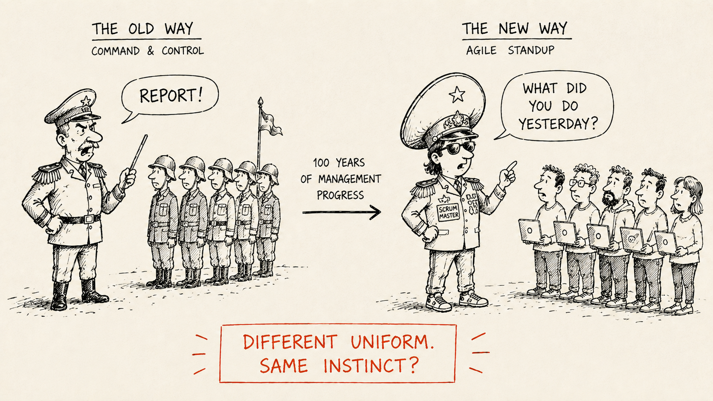

If you search for the benefits of daily standups, you'll find an impressive list.

They improve team alignment. They identify blockers. They strengthen collaboration and communication. They increase transparency. Some articles even claim they boost team morale and motivation.

It sounds like fifteen minutes a day is all you need to build the team of your dreams.

My experience has been somewhat different.

After years of working in software teams, I've come to believe that the daily standup is one of the most common—and most useless—parts of the software delivery process.

Not because communication is unnecessary.

But because a well-organized software delivery process should already make most of the information exchanged during a standup visible without requiring everyone to stop working and talk about it.

## What a 15-Minute Standup Actually Costs

A fifteen-minute standup doesn't necessarily cost fifteen minutes.

The obvious cost is easy to calculate: multiply the length of the meeting by the number of people attending it.

But that's only the visible part.

Meetings interrupt work before they actually begin. If I know I have a standup in fifteen minutes, I'm unlikely to start something that requires deep concentration. Instead, I check the board, prepare my update, answer a few messages, and wait for the meeting.

Then comes the standup itself.

And when it's over, I don't instantly return to the exact mental state I was in before it started. I need time to get back into the problem, reconstruct the context in my head, and regain focus.

Personally, I can easily lose fifteen minutes before a standup and another fifteen or twenty afterward.

Yes, after talking to actual human beings, I sometimes need a moment to recharge.

So a thirty-minute standup can easily consume an hour of my productive time.

Now multiply that by an entire engineering team.

That's the part of meeting cost that rarely appears on a calendar.

A recurring meeting doesn't only consume the time between its start and end. **It creates an interruption around itself.**

And daily standups are particularly expensive because they often sit directly inside the most productive part of the morning.

For a business, the question therefore shouldn't be:

*"Can we afford fifteen minutes for a daily standup?"*

It should be:

**"Is the information we're getting from this meeting worth interrupting the productive work of an entire team every single day?"**

## Demotivation Is Contagious

Then the updates begin.

There is almost always someone who isn't prepared.

They can't quite remember what they did yesterday or what they're supposed to be doing today. They open the board. They search for their tickets. They sigh. They read the titles aloud in a slow monotone while everyone else waits.

As a developer, this frustrates me for a simple reason: I'm giving up some of the most productive time of my day for this meeting. The least I expect is that everyone arrives knowing what they want to say.

But for the business, there is a bigger problem.

**Low engagement is contagious.**

When one person regularly arrives unprepared and treats the standup as a ritual to get through, they don't just waste a few minutes of everyone else's time. They demonstrate a standard of engagement that the rest of the team can see.

And if that behavior is accepted every morning, it gradually becomes normal.

Someone else stops preparing. Updates get slower. People start reading ticket titles directly from the board. Attention disappears.

The standard quietly drops from *"Let's quickly exchange useful information"* to *"Let's get through this ritual."*

Nobody explicitly decided to lower the standard.

It simply became the standard through repetition and acceptance.

And that's what makes this more than an annoying meeting problem.

**A process designed to improve team engagement can end up normalizing disengagement instead.**

## A Well-Organized System of Doing Nothing

There is another, less obvious side of daily standups.

They can create the illusion that activity equals progress.

One ticket is blocked. Another is waiting for a reply. A task moves to Done, comes back with a bug, gets reopened, and eventually returns as another ticket with slightly different wording.

Statuses change. Tickets move. Blockers are declared. Discussions happen.

There is always something to report.

And that's exactly the problem.

**Having something to report is not the same as getting something done.**

Daily standups create a subtle incentive: they reward having something to report rather than having something to deliver.

If you can explain what you did yesterday, why something is blocked today, and what you're waiting for tomorrow, you've successfully completed the ritual. You have demonstrated activity.

You haven't necessarily delivered anything.

Over time, this can create a strange definition of work: **if I can account for my day, I must have been productive.**

From the outside, everything looks organized. There are tickets, statuses, blockers, discussions, and daily updates.

But sometimes it feels like a remarkably well-organized system of doing nothing.

There is plenty of movement. Just not necessarily any progress.

**I like to think of this as Brownian motion for Jira tickets.**

## Daily Standups Teach Your Best People to Slow Down

But watching all this movement every morning creates another problem.

It shows highly engaged people something they might otherwise never see so clearly: **the actual level of performance the organization is willing to accept.**

People don't have the same level of motivation. Some are deeply engaged in the project. Some do exactly what is expected of them. Others mostly try to get through another working day.

For a business, highly engaged people are an incredibly valuable resource. They push things forward without being pushed, solve problems that aren't explicitly assigned to them, and care about the result.

But daily standups expose them to something surprisingly demotivating: the actual pace of everyone around them.

When I don't know exactly how productive everyone else is, my instinct is to keep pushing. I want to do good work and be one of the strongest contributors on the team.

Then I listen to the same updates every morning.

One person is blocked again. Another is waiting for something. Someone spent another day in meetings. A ticket hasn't moved all week.

And eventually I realize that I already am.

More than once I've found myself thinking:

*"Am I the only person here actually trying to create something meaningful while everyone else is just collecting a paycheck?"*

That's not a particularly healthy thought. But the next one is much more dangerous for the company:

*"If this level of productivity is apparently good enough, why am I pushing myself so hard?"*

And this is where daily standups can send a management signal that nobody intended to send.

If the same blockers appear day after day, tickets barely move, progress remains slow—and every morning still ends with:

*"Great job, team."*

then the message is difficult to miss.

**Apparently, this is good enough.**

No manager has to say it explicitly. Repeated acceptance communicates the performance standard on its own.

And once high performers realize they're already comfortably above that standard, slowing down becomes a perfectly rational response.

The process that was supposed to improve transparency has instead shown your most engaged people exactly how much less they could do and still be considered successful.

## Why Is Everyone Even in This Meeting?

Another common problem with daily standups is team size.

Figuring out exactly who needs to coordinate with whom requires good organizational design. There is a much easier solution:

**Invite everyone.**

Developers. QA. DevOps. Designers. Analysts. Sometimes even support and marketing.

This guarantees that the right person is probably in the room. It also guarantees that many of the wrong people are there too.

**When management can't clearly define who needs to coordinate with whom, the entire team ends up paying for that uncertainty with their time.**

If three people need to solve a problem, let those three people talk. The other ten don't need to be the audience.

### Nobody Is Actually Listening

Large standups create another problem.

**Attendance creates the illusion of communication.**

From a management perspective, if everyone was in the meeting, the information was shared.

Except it often wasn't.

When most of a meeting is irrelevant to someone, not listening becomes a perfectly rational response.

I learned this firsthand. I once raised the same issue in more than ten standups, explaining why it mattered and what could happen if we ignored it.

Eventually, it became a real production problem.

The team reacted as if they were hearing about it for the first time.

**Putting information into a meeting doesn't mean that information has entered the organization.**

A company can have everyone attending the same meeting every morning and still have a serious communication problem.

## Standups Become a Place for Everything

The purpose of a daily standup is usually clear: give a short update, identify blockers, and move on.

The problem is keeping it that way.

Someone mentions a technical issue. Another person suggests a solution. A third joins in. Within seconds, a status update has turned into a detailed discussion while the rest of the team waits.

**The standup gradually becomes a general-purpose meeting simply because the entire team is already in the room.**

Preventing this requires discipline: stop the discussion, identify who actually needs to be involved, and move it outside the standup.

Otherwise, a fifteen-minute status meeting can quickly become forty minutes of conversations relevant to only a fraction of the team.

There is another problem: spontaneous discussions produce spontaneous decisions.

Those decisions should be reflected in the relevant tasks. But often they aren't. They remain nothing more than something that was said during yesterday's standup.

So the meeting creates two problems at once: **it wastes people's time while important decisions can disappear the moment the call ends.**

## Daily Standups Destroy One of the Biggest Advantages of Modern Work

One of the biggest advantages of modern software work is flexibility.

Software development is creative work. Developers don't produce value at a constant rate throughout an eight-hour day. Giving experienced developers some control over their schedule lets them organize work around their most productive periods.

One developer may be dropping a child off at kindergarten at 9:00 AM. Another may need twenty quiet minutes with coffee before diving into a difficult problem. Someone else may already be deep in productive work.

**A mandatory daily meeting forces all of them to organize their morning around the same arbitrary point in time.**

For a business, that trade-off only makes sense if the meeting creates enough value to justify taking that flexibility away.

## If Your Task Management System Works, Why Do You Need a Standup?

This brings me to what I think is the fundamental problem with daily standups.

If you keep them short and focused, what information are they actually supposed to provide?

What was completed? What is currently in progress? What comes next? What is blocked?

**A well-run software delivery process should already make all of this visible.**

The task management system should be the single source of truth about the current state of the project. A manager shouldn't need to wait until tomorrow morning to discover that something is blocked, and a developer shouldn't need to verbally report progress for that progress to become visible.

If the board is accurate and continuously maintained, the daily standup becomes largely redundant.

You're gathering an entire engineering team every morning to verbally reproduce information that already exists in the system.

And if the board *isn't* accurate, adding a meeting doesn't solve the underlying problem.

**The solution isn't another reporting layer. The solution is to build a delivery process you can actually trust.**

### A Relic of Command-and-Control Thinking

Sometimes I can't escape the feeling that the daily standup belongs to a much older management tradition.

I imagine a general lining up soldiers every morning to confirm that everyone is present and following orders.

Obviously, that's not where Scrum literally came from. But the ritual can reflect a surprisingly similar management instinct:

*"Everyone must appear at the same time and explain what they're doing so we know everything is under control."*

For modern engineering organizations, that's a questionable definition of control.

**Management visibility shouldn't depend on developers verbally proving every morning that work is happening.**

A well-run delivery process should make progress, ownership, and blockers visible continuously. Managers should be able to understand the state of the project without assembling the team for a daily roll call.

If that visibility disappears the moment you remove the meeting, the standup may not be creating control.

**It may simply be compensating for the lack of it.**

## Replace the Meeting With a System

So what should you do instead?

My preferred solution is simple: **remove the daily standup and replace it with a process that doesn't need one.**

Keep the task management system continuously updated and treat it as the single source of truth.

If something is blocked, update it immediately. If someone needs help, contact the people who can actually help. If a discussion is needed, involve only the relevant people. If a decision is made, document it in the task.

If daily reporting is still required, make it asynchronous. Let people post a short update in a shared channel without interrupting the entire team at the same time.

And if you still need a live standup, keep it small, short, and strictly focused on coordination—not problem-solving.

**A good software delivery process shouldn't require an entire team to stop working once a day just to explain what the process itself should already make visible.**