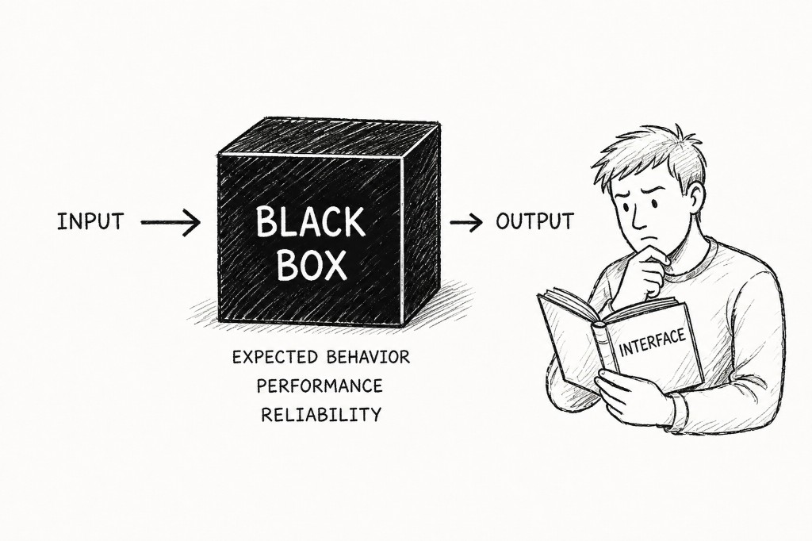
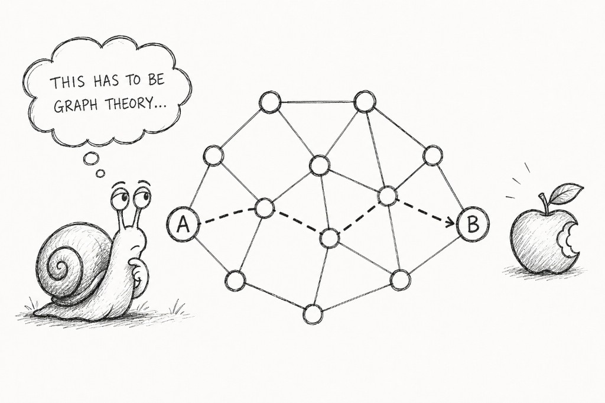
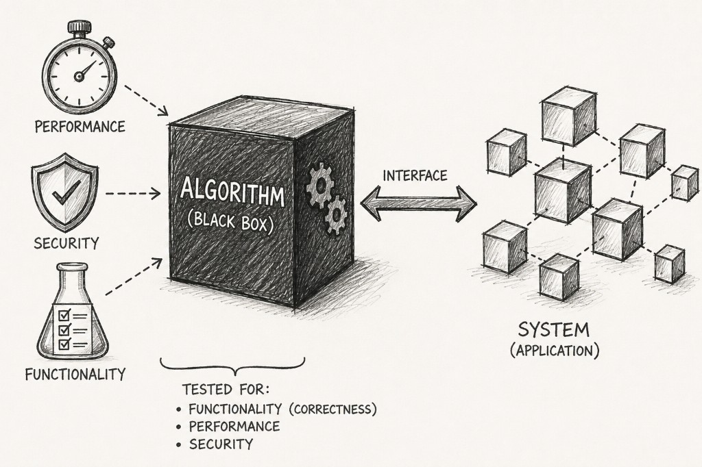
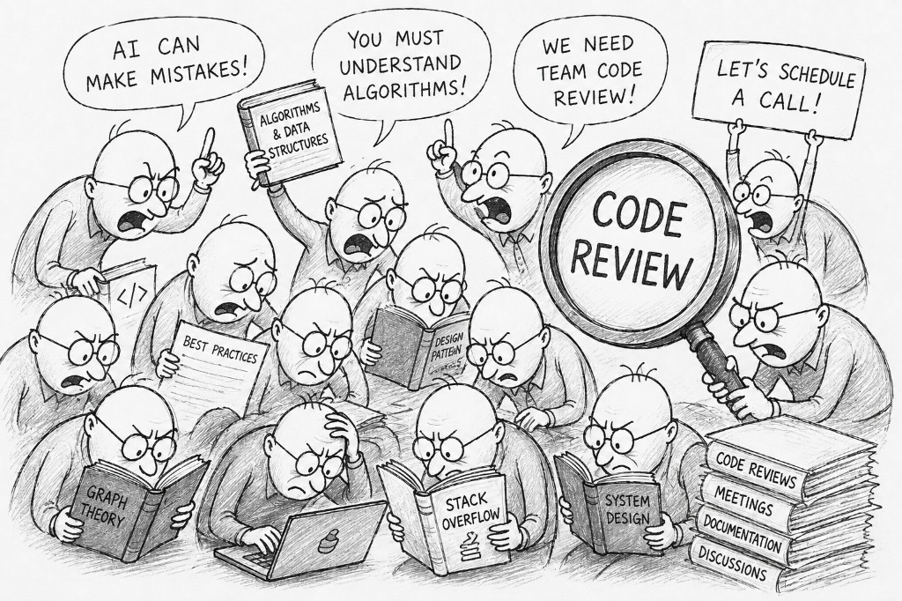
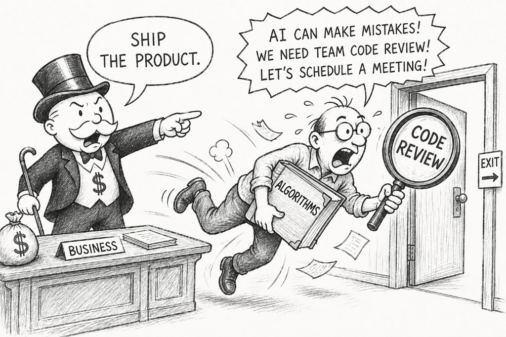

## The Black Box Principle

One of the oldest and most important ideas in software engineering is the concept of a black box. A black box is a component whose internal implementation is hidden behind a well-defined interface. As developers, we don't need to understand every line of code inside it. We only need to know what goes in, what comes out, and whether it satisfies its contract in terms of expected behavior, performance, and reliability.

Modern software simply couldn't exist without this principle. Every application depends on thousands of black boxes—frameworks, libraries, databases, operating systems, network protocols, and cloud services. If developers insisted on understanding every implementation before using it, software projects would never ship.

At first glance, there seems to be nothing new about this idea. Black boxes have been a fundamental part of software engineering for decades. Yet AI made me look at this principle from a completely different perspective.

## A Problem That Made Me Rethink Black Boxes

While working on one of my recent projects, I needed to solve a graph traversal problem: finding the shortest path between two connected nodes and calculating the total distance of that path.

I have a technical education, so at some point I studied plenty of mathematics. After twenty years of building web applications, though, almost all of it had been replaced by Angular, TypeScript, HTTP, Docker, SQL, and countless other things. Looking at the problem, I thought, "This has to be graph theory." And that was about the extent of what I remembered.

## How Developers Solved This in 2015

At that point, I had several options.

I could have pulled a graph theory textbook off the shelf, spent days refreshing concepts I'd forgotten years ago, and eventually implemented the algorithm myself. Some developers genuinely take that route.

I could have searched for articles explaining shortest-path algorithms and tried to understand which one best fit my problem.

I could have browsed Stack Overflow, hoping someone had already solved something similar.

Or I could have searched for an existing graph library, learned its API, and integrated it into the project.

Fortunately, this wasn't 2015 anymore.

We have AI.

## I Described the Problem. AI Chose the Algorithm.

So instead of asking for an algorithm, I described the problem.

"I have a collection of nodes connected by edges. I need to find the shortest path between any two nodes and calculate the total distance of that path."

That was it.

A few minutes later, I had a working algorithm.

## Verify the Behavior, Not the Implementation

My next concern wasn't how it worked internally. It was whether it actually produced the correct results.

To verify that, I asked AI to generate a small helper service. It allowed me to select any two nodes on the map, execute the algorithm, highlight the calculated shortest path, and display its total distance.

By interacting with the graph and visually inspecting the generated routes, I quickly confirmed that the algorithm behaved exactly as expected. Instead of reasoning about the implementation, I was testing its observable behavior.

## From Generated Code to an Engineering Component

Once I was satisfied that the algorithm worked correctly, I gave AI another prompt.

I asked it to refactor the implementation into a dedicated class with a single responsibility.

It defined clear input and output interfaces, extracted the graph model into its own data structures, and generated a service responsible for invoking the algorithm from the rest of the application.

In just a few minutes, what had started as a standalone algorithm had become a well-structured, self-contained module that matched the architecture of the project.

## Building Confidence Without Reading the Code

At this point, I had a well-structured, self-contained component with a clear contract.

The next step was performance validation. I asked AI to generate large synthetic datasets that closely resembled the real graphs used by my application. Running the algorithm against those datasets confirmed that its execution time was well within my performance requirements.

Finally, I asked AI to generate a comprehensive suite of unit tests to ensure the implementation would remain stable as the project evolved.

At that point, I had a production-ready algorithm—and, more importantly, complete confidence that it solved my problem.

## “But You Don’t Understand How It Works”

At this point, I can already hear many developers objecting:

"But you don't even understand how the algorithm works. Before putting it into production, you should study graph theory, read articles comparing shortest-path algorithms, look up implementations on Stack Overflow, and perform a proper code review of the AI-generated code."

And to be fair, that's exactly what many experienced developers would do today. We constantly hear that reviewing AI-generated code is the new bottleneck in software development. Countless blog posts and YouTube videos argue that developers must carefully inspect every line AI produces before trusting it.

## I Never Reviewed the Algorithm

I took a completely different approach.

I never read a single article about graph algorithms. I never compared alternative implementations. I never performed a traditional code review of the generated algorithm. In fact, I never even read AI's reasoning while it was generating the solution.

I'll let you in on a little secret: as I'm writing this article, I'm still not entirely sure which shortest-path algorithm AI generated. I assume it's from graph theory—but I honestly don't care.

## Three Criteria That Actually Matter: Expected Behavior. Performance. Security.

And that's exactly why I didn't need to.

For me, the code itself is not the goal. Code is simply an implementation of a solution, and I judge that solution by three criteria.

**Expected Behavior.** Does it produce the expected results? I verified that by generating a small visualization tool that allowed me to interactively test the algorithm against real scenarios. Every result matched my expectations.

**Performance.** Can it handle my workload efficiently? I generated large synthetic datasets that reflected my production use case and benchmarked the algorithm against them. Execution times were measured in milliseconds—more than sufficient for my needs.

**Security.** Can I safely integrate it into my application? Since this component is pure computational logic with no network access, file system interaction, or DOM manipulation, traditional vulnerabilities such as SQL injection or XSS were not a concern. Nevertheless, I still treated it like any other piece of production code. I ran static analysis, dependency security checks, linting, and type validation, while the accompanying test suite protected against regressions. In other words, I trusted the results of independent verification—not the fact that the code was generated by AI.

## Creating My Own Black Box

At this point, I deliberately started treating the implementation as a black box.

I isolated it into a dedicated component with a single responsibility. I defined explicit input and output interfaces, separated the graph model from the algorithm itself, integrated it into the application through a dedicated service, and protected its behavior with automated tests.

As a result, the component had clear boundaries, a well-defined contract, and a stable integration point. I knew exactly what it expected as input, what it guaranteed as output, and how the rest of the application interacted with it.

Ironically, I had more confidence in this component than I would have had in an implementation I had written entirely myself.

Notice what I didn't outsource to AI.

AI generated the implementation, but every engineering decision remained mine.

I decided where the component belongs in the architecture, defined its boundaries and interfaces, determined how it would be integrated, and established how it would be validated and tested.

AI generated the implementation. I remained responsible for engineering.

## A Black Box Is Still a Black Box

And that's exactly what a black box has always been.

For decades, software engineers have relied on code they didn't fully understand internally. Every application is built on frameworks, libraries, operating systems, databases, networking stacks, and countless other components whose implementations most developers never read.

We don't perform a code review of every framework method we call. We don't inspect the internals of every open-source library before using it. We trust these components because they expose a clear contract, have been validated, tested, benchmarked, and proven reliable.

Imagine a developer telling you:

"I don't trust this library. Before using it, I'm going to study its entire implementation, review every method, and understand every algorithm inside it."

Most engineering teams would consider that an unreasonable use of time.

## Your Engineering Team May Be Ignoring AI’s Biggest Advantage

Yet when the very same black box is produced by AI instead of another developer, many engineers suddenly believe they must understand every line before they can trust it.

I believe that's the wrong mental model.

For business, the consequences are obvious.

Every hour spent reverse-engineering AI-generated code that has already been validated for expected behavior, performance, and security is an hour not spent delivering customer value.

Businesses don't pay engineers to understand every algorithm ever invented. They pay them to solve problems, reduce risk, and ship reliable software.

The teams that learn to treat AI-generated components as properly validated black boxes will move dramatically faster than teams that insist on understanding every implementation before allowing it into production.
